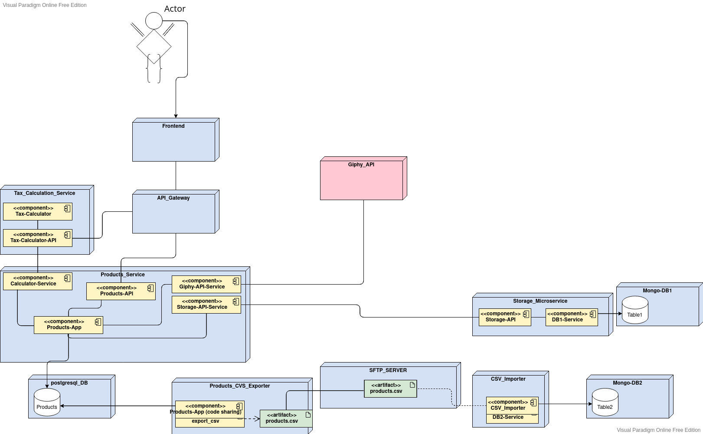
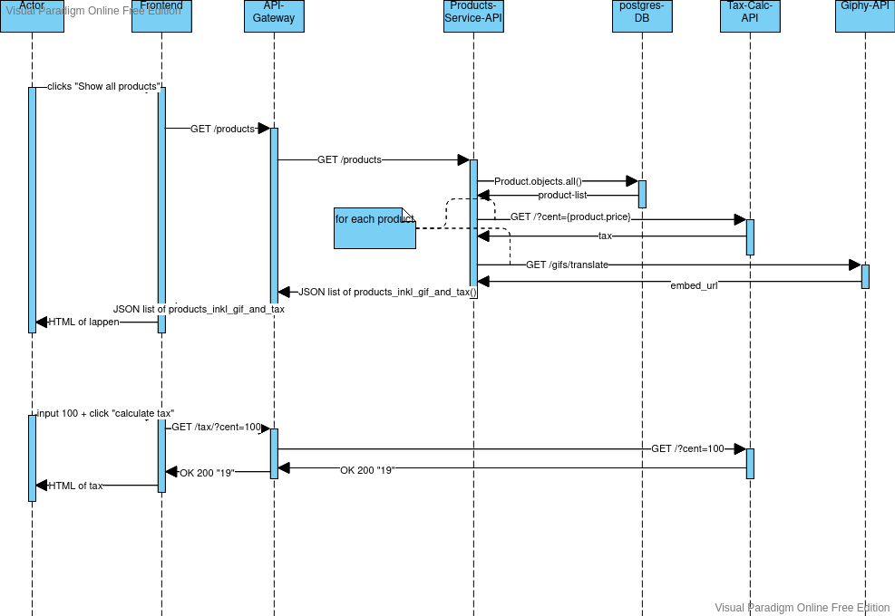

# KBE
Trello board for this project can be found here: [Kanbantemplate](https://trello.com/b/C4nsXSoo/kanban-template)


In order to access the GIPHY-API you need to get your personal API-key for developers here: https://developers.giphy.com/docs/api#quick-start-guide
Once that is done, clone this repository and rename the file ".pleaseChangeMeToenv" to ".env". This is where your new Giphy Key and other authentication credentials go.
now you can open a Terminal in your cloned directory and run:
```
$ docker-compose up
```
This starts up a cluster of:
 1. products (the main app that offers all the products inkl. gif and tax),
 2. db (a postgres db linked directly to products service)
 3. tax-calculator (a service to calculate 19% tax to a given amount in cents), 
 4. products-csv-exporter,(shares the codebase with products, automatically exports a csv of all products every 10 seconds)
 5. sftp (sftp server, find documentation for this docker image here: https://hub.docker.com/r/atmoz/sftp)
 6. products-csv-importer, (a container running a python script using pymongo https://pymongo.readthedocs.io/en/stable/)
 7. Mangodb1 (Mongodb. find documentation for this docker-image here: https://hub.docker.com/_/mongo)
 8. Mangodb2 (same Mongodb image for csv import)

in order to look into one of your running docker-containers run
```
$ docker-compose exec <the name of your container> bash
```
(I changed this to
```
$ hexhex <the name of your container> bash
```
on my machine and can highly recommend)

once you hexed a shell in: 
 1. products,
 2. tax-calculator, 
 3. products-csv-exporter,
 4. products-csv-importer, 

you can activate the virtual env by running: 
```
$ source `poetry env info --path`/bin/activate
```
That is because this Projekt uses Poetry as a package-management-tool https://python-poetry.org/docs/
and because the containers listed above are build using Django, you might want to have a look at https://django-book.readthedocs.io
In order to not only GET products from your products-Service but also PUT new products into db you have to create a superuser with Django's manage.py
```
$ python manage.py createsuperuser
```
with your password and username set here, you can then also insert new Products into your server, once you logged into your products app.
your trusty endpoints would be: 
1. API-Gateway for products = http://localhost/products/
2. API-Gateway for tax-calculator = http://localhost/tax-calculator/?cent=100
3. API-Gateway for swagger documentation of products-API = http://localhost/products/swagger/
each container can be accessed directly via:
4. Product_Service = http://localhost:8000/products/ -> I chose productssuperuser=admin password=passwort123
5. Swagger documentation of Products_Service API = http://localhost:8000/swagger/#/
6. Tax_Calculation_Service = http://localhost:8001/mwst/?cent=100



1. mkdir 'myfunnyproject'
2. poetry init
3. skip through creating pyproject.toml creation
4. poetry add django
5. django-admin startproject 'myfunnyprojectapp
6. cd 'myfunnyprojectapp'
7. poetry run python manage.py runserver starts the server -> visit localhost:8000 to check if install was successfull
   (from: https://rasulkireev.com/managing-django-with-poetry/)
    btw. If you need to have the requirements.txt file with all the dependencies, 
   you can run poetry export -f requirements.txt --output requirements.txt. 
   If you have configured a CI/CD job that auto deploys your project, you can add 
   this function as a step, which will generate the updated version on each update.
o inlcude restframework https://www.django-rest-framework.org/tutorial/quickstart/ i included a super user psswd passwort123

